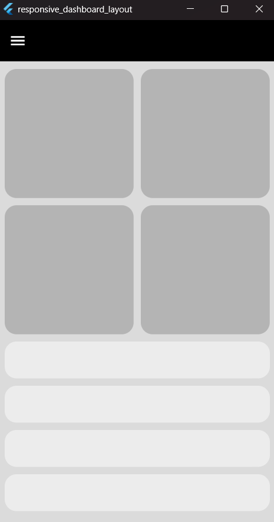
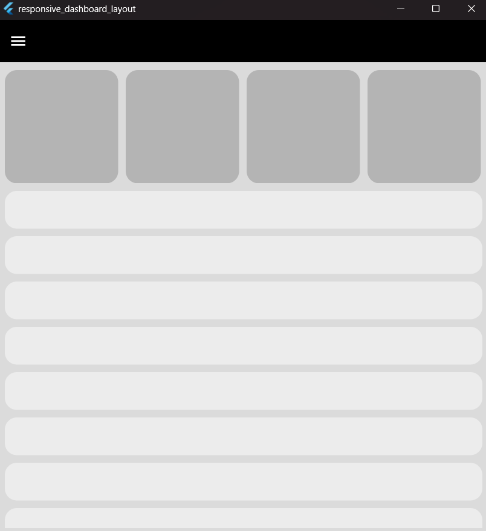
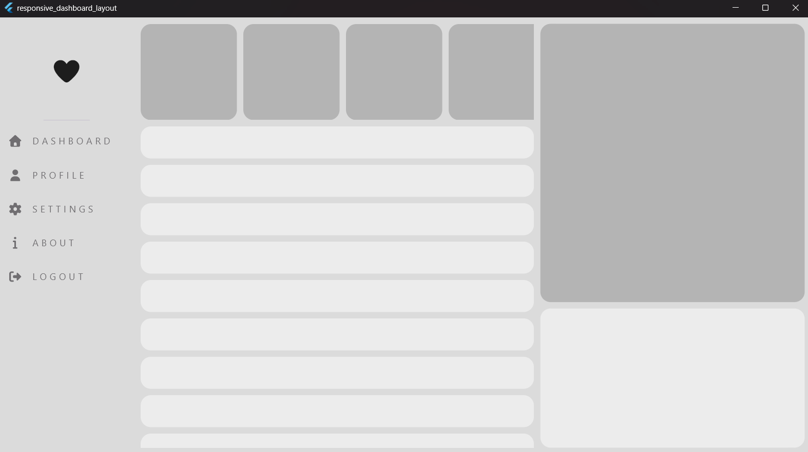

# Responsive Dashboard Layout

A responsive dashboard UI built with Flutter that adapts to **mobile, tablet, and desktop** screens.

## UI Preview

### Mobile Layout

### Tablet Layout

### Desktop Layout

## Tech

* Flutter
* Dart
* Responsive Layout

## Author

Ahmed Omara
